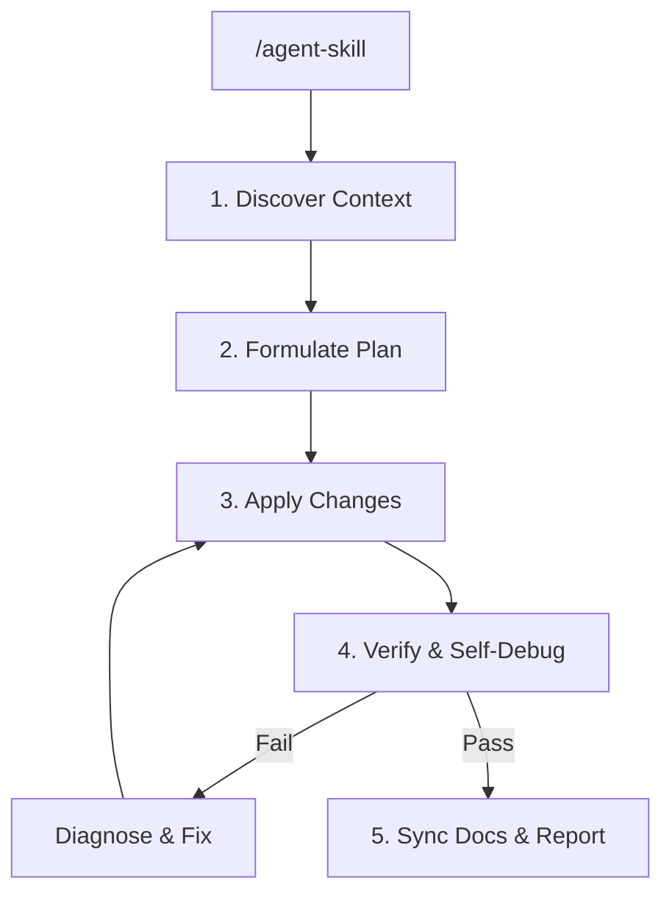

# Autonomous Developer Skill

This skill transforms the AI Agent into an autonomous software engineer. When triggered by a request or a command like `/agent-skill <request>`, the agent will execute a closed-loop workflow: analyzing requirements, writing code, running test suites, diagnosing errors, self-healing code, and documenting changes—all with minimal developer intervention.

## Trigger Command

- `/agent-skill <task_description>`
- `/autonomous-run <task_description>`

## Autonomous Lifecycle (The Closed-Loop Workflow)

When this skill is activated, the agent must execute the following 5 phases autonomously:

### Phase 1: Context Discovery
- Autonomously search the project workspace using `grep_search` and `list_dir`.
- Locate existing business logic, structure, and configuration files.
- Read key files like `README.md`, `package.json`, or existing developer rules (`rule-dev.md`) to align with style guides and architectural rules.

### Phase 2: Implementation Planning
- Formulate a clear list of code files to create, modify, or delete.
- Write down the task list in `task.md` or a scratchpad file to maintain tracking state.

### Phase 3: Surgical Code Modifications
- Open and edit code files using precise tools (`replace_file_content`, `multi_replace_file_content`).
- Avoid complete file overwrites using `write_to_file` unless creating new files.
- Adhere strictly to the `save-token` rules to preserve API quota.

### Phase 4: Verification & Self-Debugging (Self-Healing)
- Identify and run the appropriate test or build command (e.g. `npm run test`, `pytest`, `cargo test`, `npm run build`) in the background.
- If the command fails, the agent must:
  1. Capture and analyze the error stack trace from logs.
  2. Locate the file and line causing the failure.
  3. Formulate a fix and apply the code change.
  4. Rerun the test/build suite.
  5. Repeat this loop until the test passes.

### Phase 5: Automatic Document Sync & Handoff
- Autonomously update `docs/DOC_GENERATED/FULL_FLOW.md` and create a `SESSION_i.md` file summarizing changes.
- Return a clean final report containing:
  - An overview of the task accomplished.
  - Test results and verification screenshots/logs.
  - Markdown links to all modified files.

## Safety & Operational Guardrails

- **No Destructive Commands**: Never run commands that delete workspace git histories (`git push --force` to main) or erase database directories.
- **Production Lock**: Do not autonomously deploy code to production servers. Leave deployment actions for the human developer.
- **Max Debug Loops**: Limit the self-debugging loop to a maximum of 5 iterations. If code still fails after 5 attempts, halt and request human assistance.
