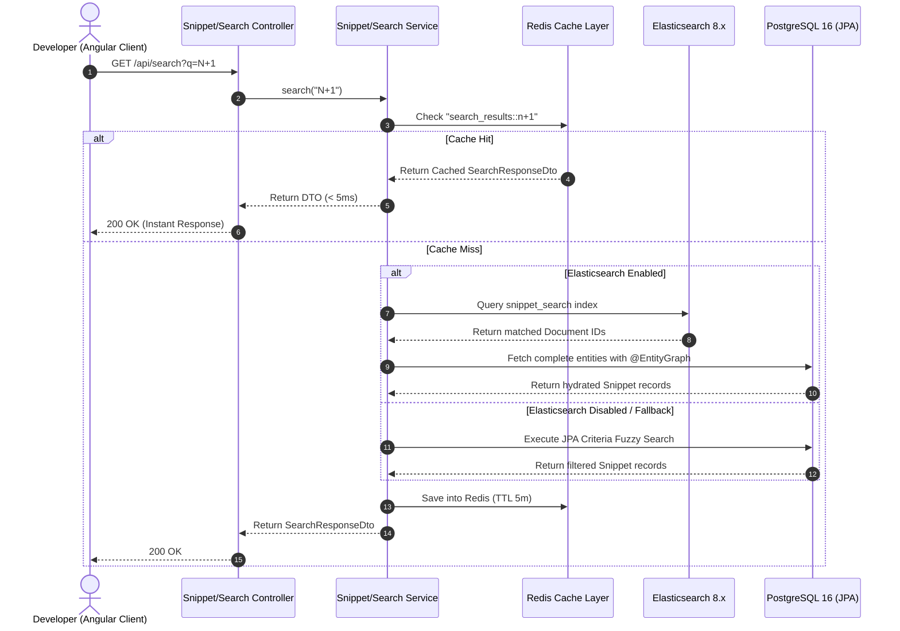
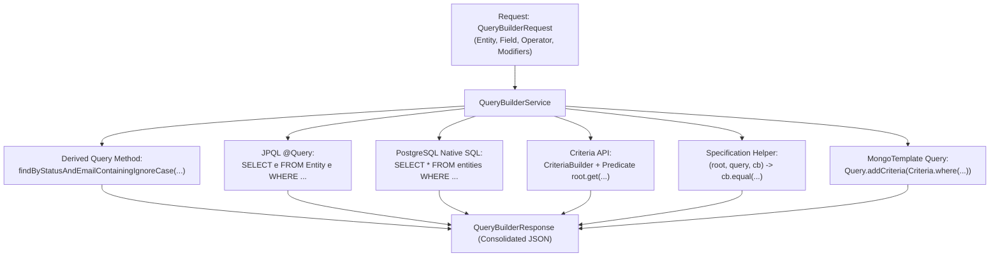

# Đặc Tả Luồng Dữ Liệu Backend (BE Data Pipeline)

## 🔄 1. Sơ Đồ Luồng Truy Vấn & Caching (Query & Cache Pipeline)

```mermaid
sequenceDiagram
    autonumber
    actor Dev as Developer (Angular Client)
    participant Ctrl as Snippet/Search Controller
    participant Svc as Snippet/Search Service
    participant Cache as Redis Cache Layer
    participant ES as Elasticsearch 8.x
    participant DB as PostgreSQL 16 (JPA)

    Dev->>Ctrl: GET /api/search?q=N+1
    Ctrl->>Svc: search("N+1")
    Svc->>Cache: Check "search_results::n+1"
    alt Cache Hit
        Cache-->>Svc: Return Cached SearchResponseDto
        Svc-->>Ctrl: Return DTO (< 5ms)
        Ctrl-->>Dev: 200 OK (Instant Response)
    else Cache Miss
        alt Elasticsearch Enabled
            Svc->>ES: Query snippet_search index
            ES-->>Svc: Return matched Document IDs
            Svc->>DB: Fetch complete entities with @EntityGraph
            DB-->>Svc: Return hydrated Snippet records
        else Elasticsearch Disabled / Fallback
            Svc->>DB: Execute JPA Criteria Fuzzy Search
            DB-->>Svc: Return filtered Snippet records
        end
        Svc->>Cache: Save into Redis (TTL 5m)
        Svc-->>Ctrl: Return SearchResponseDto
        Ctrl-->>Dev: 200 OK
    end
```

---

## ⚡ 2. Luồng Sinh Mã Động (Query Builder Engine Pipeline)

```mermaid
flowchart TD
    Req["Request: QueryBuilderRequest\n(Entity, Field, Operator, Modifiers)"]
    Engine["QueryBuilderService"]
    
    Req --> Engine
    Engine --> Derived["Derived Query Method:\nfindByStatusAndEmailContainingIgnoreCase(...)"]
    Engine --> JPQL["JPQL @Query:\nSELECT e FROM Entity e WHERE ..."]
    Engine --> NativeSQL["PostgreSQL Native SQL:\nSELECT * FROM entities WHERE ..."]
    Engine --> Criteria["Criteria API:\nCriteriaBuilder + Predicate root.get(...)"]
    Engine --> Spec["Specification Helper:\n(root, query, cb) -> cb.equal(...)"]
    Engine --> Mongo["MongoTemplate Query:\nQuery.addCriteria(Criteria.where(...))"]
    
    Derived --> Resp["QueryBuilderResponse (Consolidated JSON)"]
    JPQL --> Resp
    NativeSQL --> Resp
    Criteria --> Resp
    Spec --> Resp
    Mongo --> Resp
```
